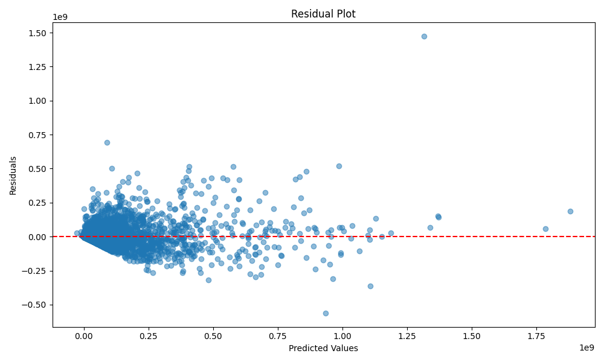

# Movie Success Prediction Project

## Project Overview
This project aims to build models that classify the success of movies and predict their revenue using Kaggle's The Movies Dataset. The ultimate goal is to support data-driven decision-making in the film industry.

### Dataset
- Source: [The Movies Dataset](https://www.kaggle.com/datasets/rounakbanik/the-movies-dataset?select=movies_metadata.csv)
- Size: 45,000 movies with 24 features
- Selected Features: 6 numeric and 2 categorical variables

## Project Structure

```
dataScienceTermProject/
├── data_processor.py      # Data preprocessing and feature engineering
├── model_trainer.py       # Model training and evaluation
├── prediction.py          # Main prediction pipeline
├── movies_metadata.csv    # Movie dataset
├── requirements.txt       # Project dependencies
└── visualizations/        # Generated visualizations
```

## Data Processing Pipeline

### 1. Data Preprocessing
- Numeric data conversion (`budget`, `revenue`) and filtering (> 0)
- Missing value handling:
  - `runtime`: Median imputation
  - `release_date`: Date conversion and null removal
  - `original_language`: Mode imputation

### 2. Categorical Data Processing
- `genres`: Multi-label encoding using `MultiLabelBinarizer`
- `original_language`: One-hot encoding using `OneHotEncoder`

### 3. Label Creation
- Binary classification label (`success`) based on revenue/budget ratio ≥ 2

## Model Training

### Classification Models
- Random Forest
- Logistic Regression
- Gradient Boosting
- Evaluation Metrics: Accuracy, ROC-AUC, F1 Score

### Regression Models
- Random Forest
- Gradient Boosting
- Evaluation Metrics: MAE, RMSE, R²

### Cross-Validation
- 10-fold cross-validation
- StratifiedKFold for classification
- KFold for regression

### Hyperparameter Tuning
- GridSearchCV for Random Forest
- Parameters tuned: n_estimators, max_depth, min_samples_split

## Requirements

```
pandas>=1.3.0
numpy>=1.20.0
scikit-learn>=1.0.0
matplotlib>=3.4.0
seaborn>=0.11.0
```

## Installation

1. Clone the repository
2. Create a virtual environment:
   ```bash
   python -m venv .venv
   source .venv/bin/activate  # On Windows: .venv\Scripts\activate
   ```
3. Install dependencies:
   ```bash
   pip install -r requirements.txt
   ```

## Usage

Run the main prediction pipeline:
```bash
python prediction.py
```

## Visualization Analysis

### Data Analysis Visualizations

#### Correlation Heatmap

*Analysis of relationships between numerical features*
- Shows strong correlation between budget and revenue
- Reveals meaningful relationships between vote_count and popularity
- Helps identify key predictors for movie success

#### Success Distribution

*Distribution of movie success based on revenue/budget ratio*
- Visualizes the balance between successful and unsuccessful movies
- Helps assess the appropriateness of success criteria
- Indicates potential class imbalance in the dataset

#### Language Distribution

*Top 10 most common movie languages*
- Shows dominance of English-language films
- Reveals distribution of non-English films
- Helps understand dataset composition

### Model Performance Visualizations

#### Classification Model Performance

*Comparison of classification models' performance metrics*
- GradientBoosting shows best overall performance
- High ROC-AUC indicates strong class separation
- Balanced performance across all metrics

#### Regression Model Performance

*Comparison of regression models' performance metrics*
- Both models show strong results
- GradientBoosting slightly outperforms RandomForest
- Low MAE and RMSE indicate good prediction accuracy

### Feature and Prediction Analysis

#### Feature Importance

*Top 10 most important features for prediction*
- Identifies key factors influencing movie success
- Budget and popularity emerge as top predictors
- Helps understand feature impact on predictions

#### Prediction Analysis

*Comparison of predicted vs actual values*
- Good prediction accuracy for low to mid-range revenues
- Some underestimation for high-revenue movies
- Most predictions align with the ideal line

#### Residual Plot

*Analysis of prediction residuals*
- Residuals centered around zero indicate no major bias
- Wider spread for high-revenue predictions
- Some outliers suggest underestimation of blockbusters

## Model Performance Summary

### Classification Results
- GradientBoosting: Best overall performance with high ROC-AUC and F1 score
- RandomForest: Balanced performance across all metrics
- LogisticRegression: Good accuracy but weaker with class imbalance

### Regression Results
- GradientBoosting: Best model for revenue prediction
  - Lowest MAE and RMSE
  - Highest R² score
- RandomForest: Strong performance with good variance explanation
 